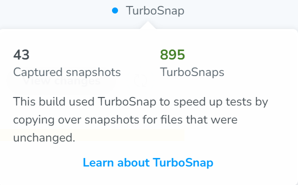
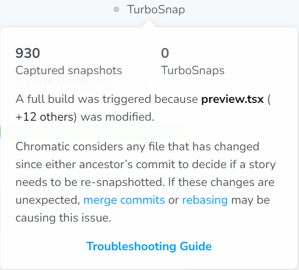

To help Workleap stay within its monthly Chromatic snapshot budget, we ask teams to follow these best practices:

## Use TurboSnap

Make sure [TurboSnap](https://www.chromatic.com/docs/turbosnap/) is enabled, and periodically check how many snapshots were caputred for your builds with and without TurboSnap.

You can log into [Chromatic](https://www.chromatic.com/) and navigate to a build's details to confirm if TurboSnap is enabled for a specific build. If you don't see the _"TurboSnap"_ ribbon on the right side of the screen, it most likely means TurboSnap is not enabled for that project.

:white_check_mark: Good

:::align-image-left
{width=298 height=185}
:::

:no_entry_sign: Bad

:::align-image-left
{width=302 height=273}
:::

## Merge PRs quickly

We often see PRs that stay open for multiple days or weeks with daily commits. Avoid this, as new snapshots (or TurboSnaps, which still cost 1/5th of a regular snapshot) are captured **every time a commit is pushed**.

As a general rule, once a PR is open and ready for review, there should be **no more than 5-10 additional commits**.

To help with this, if you need to share a PR that isn't ready for review, you can open it as a [draft](https://learn.microsoft.com/en-us/azure/devops/repos/git/pull-requests?view=azure-devops&tabs=browser#create-draft-prs). The Chromatic CLI "step" will not run for PRs marked as "draft".

> Be sure to either add `drafts: false` to your pipeline configuration or that your build policies do not run for "draft" PRs.

## Create small, fast-merging PRs for changes that disable TurboSnap

Some changes can disable TurboSnap for a build. It's often the case when a module referenced by `./storybook/preview.ts[x]` file is updated or when package dependencies are added/updated/removed.

These changes include:

- Updating React providers in the application (`Provider.tsx`)
- Updating localization files (`**/resources.json`)
- Updating environment variables
- Updating constants files (including feature flags and routes)
- Updating package dependencies (`**/package.json`)

We recommend making these changes in small, focused PRs and **merging** them **as quickly as possible**.

You can **identify** builds where **TurboSnap** is **disabled** by navigating to the build's details and looking for the _"TurboSnap"_ **ribbon** on the **right**. For instance, Chromatic may indicate that a _"full build"_ was triggered due to a change in the `.storybook/preview.ts[x]` file, possibly because React providers were updated, localized resources were modified, etc.

:::align-image-left
{width=302 height=273}
:::

You can play with the [untraced](https://www.chromatic.com/docs/configure/#untraced) setting of your project's `chromatic.config.json` file to tell chromatic to ignore some of these files:

```json chromatic.config.json
{
    "$schema": "https://www.chromatic.com/config-file.schema.json",
    "untraced": ["**/package.json"]
}
```

## Avoid importing modules from barrel files

Barrel files (`**/index.ts[x]`) are often problematic and should generally be avoided. This is particularly important when working with chromatic. If a barrel file is referenced in the `.storybook/preview.ts[x]` file and any module exported by that barrel file is updated, **TurboSnap** will be **disabled**, and a _"full build"_ will be triggered.

## Ignore package.json files

Changes to `package.json` files will **disable TurboSnap** and trigger a _"full build"_. While this can be useful if the updated package impacts the UI (e.g., Orbiter or Hopper), it is often unnecessary.

To avoid this, add the [untraced](https://www.chromatic.com/docs/configure/#untraced) setting to your project's `chromatic.config.json` file and instruct chromatic to ignore `package.json` files:

```json chromatic.config.json
{
    "$schema": "https://www.chromatic.com/config-file.schema.json",
    "untraced": ["**/package.json"]
}
```

## Ignore localization files

Changes to `resources.json` files often **disable TurboSnap** and trigger a _"full build"_ because they modify the `.storybook/preview.ts[x]` file.

To prevent this, add the [untraced](https://www.chromatic.com/docs/configure/#untraced) setting to your project's `chromatic.config.json` file and tell chromatic to ignore resource files:

```json chromatic.config.json
{
    "$schema": "https://www.chromatic.com/config-file.schema.json",
    "untraced": ["**/resources.json"]
}
```

## Avoid large constants or utils files

Changes to constants or utils files that are referenced by the `.storybook/preview.ts[x]` file will **disable TurboSnap** and trigger a _"full build"_.

Examples of such files:

- Feature flags
- Environment variables
- Routes
- Backend constants
- Dates utils
- Formatting utils

As a general rule, avoid referencing large files with multiple unrelated exports. Instead, aim for smaller and more focused files.

If you believe that updates to certain constants or utils files should not refresh the snapshot baseline, add them to the [untraced](https://www.chromatic.com/docs/configure/#untraced) setting of your project's `chromatic.config.json` file.

## Only capture snapshots for Chrome

Chromatic can capture snapshots across [multiple browsers](https://www.chromatic.com/docs/browsers/), which can be useful but also expensive because it multiplies the number of snapshots caputred by the number of browsers enabled.

For example, if both Chrome and Safari are enabled, **2 snapshots** (or TurboSnaps) will be captured for every story.

**We ask that each team enable Chrome only.**

## Avoid using Chromatic locally with Storybook

Storybook allows running visual tests locally, but this is costly as it triggers the entire suite of visual tests.

Please do not use this feature. Only run visual tests from a PR.

## Ignore PRs from the Renovate bot

We want to optimize our snapshot budget and avoid using it on PRs from the Renovate bot. Although minor or patch updates to dependencies could introduce regressions, we prefer to invest our snapshot budget in detecting regressions from changes we make directly to our codebases.

Be sure to configure your CLI to ignore PRs from the Renovate bot.

> Chromado disables PRs matching the `renovate/**` pattern by default.
