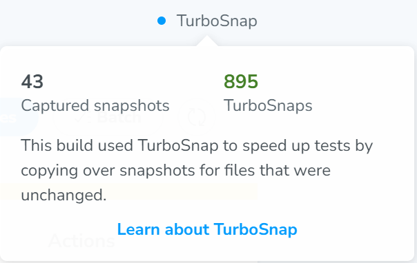
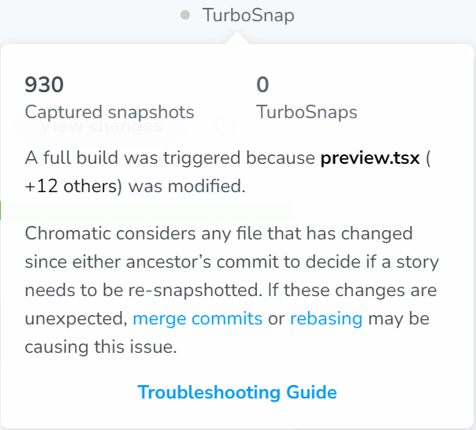

To help Workleap stay within its monthly Chromatic snapshot budget, we ask teams to follow these best practices:

## Use TurboSnap

Make sure [TurboSnap](https://www.chromatic.com/docs/turbosnap/) is enabled, and periodically check how many snapshots were taken for your builds with and without TurboSnap.

You can log into [Chromatic](https://www.chromatic.com/) and navigate to a build's details to confirm if TurboSnap is enabled for a specific build. If you don't see the _"TurboSnap"_ ribbon on the right side of the screen, it most likely means TurboSnap is not enabled for that project.

:white_check_mark: Good

:::align-image-left

:::

:no_entry_sign: Bad

:::align-image-left

:::

## Merge PRs quickly

We often see PRs that stay open for multiple days or weeks with daily commits. Avoid this, as new snapshots (or TurboSnaps, which still cost 1/5th of a regular snapshot) are taken **every time a commit is pushed**.

As a general rule, once a PR is open and ready for review, there should be **no more than 5-10 additional commits**.

To help with this, if you need to share a PR that isn’t ready for review, you can open it as a [draft](https://learn.microsoft.com/en-us/azure/devops/repos/git/pull-requests?view=azure-devops&tabs=browser#create-draft-prs). The Chromatic CLI "step" will not run for PRs marked as "draft".

## Create small, fast-merging PRs for changes that disable TurboSnap

Some changes can disable TurboSnap for a build. These changes include:

- Updating React providers in the application (usually in `Provider.tsx`)
- Modifying the `package.json` file

We recommend making these changes in small, focused PRs and **merging** them **as quickly as possible**.

You can identify builds where TurboSnap is disabled by navigating to the build's details and looking for the _"TurboSnap"_ ribbon on the right. For instance, Chromatic may indicate that a _"full build"_ was triggered due to a change in the `.storybook/preview.tsx` file, possibly because React providers were updated, localized resources were modified, etc.

:::align-image-left

:::

## Only capture snapshots for Chrome

Chromatic can capture snapshots across [multiple browsers](https://www.chromatic.com/docs/browsers/), which can be useful but also expensive because it multiplies the number of snapshots taken by the number of browsers enabled.

For example, if both Chrome and Safari are enabled, **2 snapshots** (or TurboSnaps) will be taken for every story.

**We ask that each team enable Chrome only.**

## Avoid using Chromatic locally with Storybook

Storybook allows running visual tests locally, but this is costly as it triggers the entire suite of visual tests.

Please do not use this feature. Only run visual tests from a PR.

## Ignore PRs from the Renovate bot

We want to optimize our snapshot budget and avoid using it on PRs from the Renovate bot. Although minor or patch updates to dependencies could introduce regressions, we prefer to invest our snapshot budget in detecting regressions from changes we make directly to our codebases.

Be sure to configure your CLI to ignore PRs from the Renovate bot.
