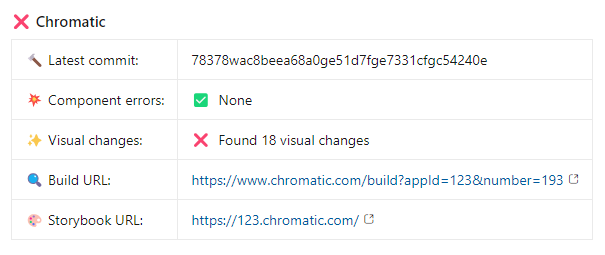
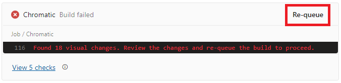

# Getting started

Welcome to the Chromado documentation, a library to seamlessly integrate [Chromatic](https://www.chromatic.com/) + [Azure Pipelines](https://azure.microsoft.com/en-ca/products/devops/pipelines). On this page, you'll discover how this package can optimize your workflow and learn how to set it up for your environment.

## Features

Chromado aims to provide a workflow similar to the native Chromatic [GitHub integration](https://www.chromatic.com/docs/github-actions/). While it's hardly as good, it's a functional workflow until Chromatic offers a native Azure Pipelines integration.

### Build notifications

The Chromatic Azure Pipelines [documentation](https://www.chromatic.com/docs/azure-pipelines/) explains how to integrate Chromatic within an existing pipeline through its CLI, but it's basically it, it lacks build notifications, it's up to you to figure out this part.

Chromado resolves this by automatically providing build notifications as pull request comments whenever a Chromatic build is completed:

:::align-image-left

:::

### TurboSnap

Chromado is compatible with [TurboSnap](https://www.chromatic.com/docs/turbosnap/) and will by default trigger Chromatic builds with TurboSnap activated.

### Squash merge

Chromatic doesn't offer any mechanism to support [squash merge](https://learn.microsoft.com/en-us/azure/devops/repos/git/merging-with-squash?view=azure-devops) on Azure DevOps. This means that when using Azure DevOps as a Git provider, if you wish to keep your Chromatic [baselines](https://www.chromatic.com/docs/branching-and-baselines/) up-to-date, you would be constrained to merging your pull requests with regular merge commits. Fortunately, Chromado implements a workflow based on Chromatic's [auto-accept-changes](https://www.chromatic.com/docs/azure-pipelines/#azure-squashrebase-merge-and-the-main-branch) feature, allowing pull requests to be completed with squash merges.

Here's how it works:

1. Whenever you create or update a pull request, a Chromatic build will automatically be triggered. If the build fails, the Chromatic pipeline will fail, and the team will need to either accept the changes or fix the issues before completing the pull request. If the changes are accepted, unfortunately the `main` branch [baselines](https://www.chromatic.com/docs/branching-and-baselines/) will not be updated.

2. To update the baselines of the `main` branch, once the pull request has been merged, a new Chromatic build will be triggered on the `main` branch. This new build will automatically accept all the changes (which is fine since they have been reviewed in the pull request) and update the `main` branch baselines.

## Setting up your workflow

First, let's create a new [Chromatic project](#create-a-new-chromatic-project), then set up your [VSCode project](#configure-your-project), and finally create an [Azure pipeline](#create-a-new-azure-pipeline).

### Create a new Chromatic project

1. Request the owner of the Chromatic `gsoft-inc-ado` organization to create a new Chromatic project for your application. Ensure that you are added as a "collaborator" to the new project.

2. Once created, login to [Chromatic](https://www.chromatic.com/) and select your application project from the list.

3. Save your Chromatic project id. You can find the project id in the project URL under the `appId` parameter. For example, if your project id is `123`, the project URL would be `https://www.chromatic.com/manage?appId=123`.

4. Go to `Manage` > `Configure` > `Project` > `Setup Chromatic with this project token` and save the project token.

5. With the Chromatic project id and token in hand, proceed to the next sections.

### Configure your project

1. Create a `chromatic.config.json` file at the root of your VSCode project and paste the following content:

```json chromatic.config.json
{
    "projectId": "<YOUR_CHROMATIC_PROJECT_ID>"
}
```

2. Replace `<YOUR_CHROMATIC_PROJECT_ID>` by your Chromatic project id.

### Create a new Azure pipeline

1. First, open your application project and create a new YAML file called `chromatic.yml`. This file will store the configuration of your Chromatic Azure pipeline.

2.1. If your project already includes a [template file](https://learn.microsoft.com/en-us/azure/devops/pipelines/process/templates?view=azure-devops&pivots=templates-includes) to set up your pipelines, then paste the following configuration:

```yaml !#19,22,27,29-30 chromatic.yml
# Run Chromatic on the "main" branch after a pull request has been merged
# (currently required to update the baseline when doing "squash" merge for pull requests).
trigger:
  branches:
    include:
      - main

# Run Chromatic on every pull request targeting the "main" branch as destination.
pr:
  branches:
    include:
      - main

steps:
  # Chromatic needs the full Git history to compare the baselines.
  # Checkout must happen before the setup template.
  - checkout: self
    displayName: Get full Git history
    fetchDepth: 0

  # Your project custom setup template.
  - template: templates/setup.yml

  - task: CmdLine@2
    displayName: Chromatic
    inputs:
      script: pnpm dlx @workleap/chromado
    env:
      CHROMATIC_PROJECT_TOKEN: $(CHROMATIC_PROJECT_TOKEN)
      CHROMATIC_PULL_REQUEST_COMMENT_ACCESS_TOKEN: $(PULL_REQUEST_COMMENT_ACCESS_TOKEN)
```

!!!info
Most of Chromatic [CLI options](https://www.chromatic.com/docs/cli/#configuration-options) are accepted by the `@workleap/chromado` script. If an option is not accepted, the script will output an error message.
!!!

2.2. If your project doesn't include a template file to set up your pipelines, paste the following configuration:

```yaml #19,54,56-57 chromatic.yml
# Run Chromatic on the "main" branch after a pull request has been merged
# (currently required to update the baseline when doing "squash" merge for pull requests).
trigger:
  branches:
    include:
      - main

# Run Chromatic on every pull request targeting the "main" branch as destination.
pr:
  branches:
    include:
      - main

steps:
  # Chromatic needs the full Git history to compare the baselines.
  # Checkout must happen before the setup template.
  - checkout: self
    displayName: Get full Git history
    fetchDepth: 0

  - task: UseNode@1
    displayName: Use Node.js >=20.0.0
    inputs:
      version: ">=20.0.0"
      checkLatest: true

  - task: Cache@2
    displayName: Cache pnpm
    inputs:
      key: '"pnpm" | "$(Agent.OS)" | pnpm-lock.yaml'
      restoreKeys: |
        "pnpm" | "$(Agent.OS)"
        "pnpm"
      path: $(Pipeline.Workspace)/.pnpm-store

  - script: |
      corepack enable
      corepack prepare pnpm@latest-8 --activate
      pnpm config set store-dir $(Pipeline.Workspace)/.pnpm-store
    displayName: Setup pnpm

  # Optional
  - task: npmAuthenticate@0
    displayName: Authenticate to private npm feed
    inputs:
      workingFile: .npmrc

  - script: pnpm install --frozen-lockfile
    displayName: pnpm install

  - task: CmdLine@2
    displayName: Chromatic
    inputs:
      script: pnpm dlx @workleap/chromado
    env:
      CHROMATIC_PROJECT_TOKEN: $(CHROMATIC_PROJECT_TOKEN)
      CHROMATIC_PULL_REQUEST_COMMENT_ACCESS_TOKEN: $(PULL_REQUEST_COMMENT_ACCESS_TOKEN)
```

!!!info
Most of Chromatic [CLI options](https://www.chromatic.com/docs/cli/#configuration-options) are accepted by the `@workleap/chromado` script. If an option is not accepted, the script will output an error message.
!!!

3. Create a new [Azure pipeline from an existing YAML file](https://www.nathannellans.com/post/azure-devops-yaml-pipelines-part-1). Name this new pipeline "Chromatic" or choose a name that best suits your project.

4. Add the newly created Chromatic pipeline as a **required** [build validation](https://learn.microsoft.com/en-us/azure/devops/repos/git/branch-policies?view=azure-devops&tabs=browser#build-validation) for your `main` branch. Ensure that the build validation is **required**. This is crucial as any visual changes detected by Chromatic will automatically be accepted on the main branch.

5. Integrate the Chromatic project id and token, saved earlier, as [pipeline variables](https://learn.microsoft.com/en-us/azure/devops/pipelines/get-started/yaml-pipeline-editor?view=azure-devops#manage-pipeline-variables) of the newly created Chromatic pipeline. These variables should be named `CHROMATIC_PROJECT_TOKEN` and `CHROMATIC_PULL_REQUEST_COMMENT_ACCESS_TOKEN`, respectively. Optionally, you can create the `CHROMATIC_PULL_REQUEST_COMMENT_ACCESS_TOKEN` variable as a [variable group](https://learn.microsoft.com/en-us/azure/devops/pipelines/process/set-secret-variables?view=azure-devops&tabs=yaml%2Cbash#set-a-secret-variable-in-a-variable-group).

| Variable | Permissions |
| --- | --- |
| `CHROMATIC_PULL_REQUEST_COMMENT_ACCESS_TOKEN` | **Pull Request Threads**: Read & Write |

## Try it :rocket:

To test your new Chromatic pipeline, follow these steps:

1. Start a Chromatic build locally by opening a terminal at the root of the project and executing the following command: `pnpm chromatic --project-token <YOUR_CHROMATIC_PROJECT_TOKEN>`.

2. Go to the [Chromatic](https://www.chromatic.com/start) application and accept all the changes to create a baseline. This guide assumes that your application already includes a few [Storybook](https://storybook.js.org/) stories.

3. Move to a new Git branch and update an existing component watched by Chromatic to trigger a visual change. Commit the change.

4. Create a pull request for your new branch in Azure DevOps.

5. A Chromatic build should automatically trigger for the pull request, and a comment with the visual change should be added to it. The comment should indicate that Chromatic detected at least one visual change.

:::align-image-left

:::

6. In the pull request comment, click on the "Build URL" link. Accept the changes in the [Chromatic](https://www.chromatic.com/start) application.

7. Re-queue the Chromatic pipeline by clicking on the "Re-queue" button of the pipeline in the pull request.

:::align-image-left

:::

8. Once the Chromatic pipeline completes successfully, merge the pull request.

9. A new Chromatic build should automatically trigger for the `main` branch. The changes from this new build should be automatically accepted by Chromatic, and the pipeline should complete successfully.

### Troubleshoot issues

If you encounter issues with the Chromatic pipeline, follow these steps:

- Try adding the `CHROMATIC_DEBUG` environment variable to `chromatic.yml` and review the [the pipeline logs](https://learn.microsoft.com/en-us/azure/devops/pipelines/troubleshooting/review-logs?view=azure-devops&tabs=windows-agent) for diagnosis:

```yaml !#8 chromatic.yml
- task: CmdLine@2
  displayName: Chromatic
  inputs:
    script: pnpm dlx @workleap/chromado
  env:
    CHROMATIC_PROJECT_TOKEN: $(CHROMATIC_PROJECT_TOKEN)
    CHROMATIC_PULL_REQUEST_COMMENT_ACCESS_TOKEN: $(PULL_REQUEST_COMMENT_ACCESS_TOKEN)
    CHROMATIC_DEBUG: true
```

- Verify that the `CHROMATIC_PROJECT_TOKEN` pipeline variable value is correct. To find your Chromatic project token, log in to [Chromatic](https://www.chromatic.com/start), select your project in the list, and go to `Manage` > `Configure` > `Project` and look for `Setup Chromatic with this project token`.

- Confirm that the `projectId` field in your `chromatic.config.json` file contains the correct project id. You can find the project id in the Chromatic project URL under the `appId` parameter. For example, if your project id is `123`, the project URL would be `https://www.chromatic.com/manage?appId=123`.

- Ensure that the `PULL_REQUEST_COMMENT_ACCESS_TOKEN` pipeline variable value is a valid, non-expired token.

- If issues persist, consider disabling [TurboSnap](https://www.chromatic.com/docs/turbosnap/) by adding the `CHROMATIC_DISABLE_TURBOSNAP` environment variable the `chromatic.yml`:

```yaml !#8 chromatic.yml
- task: CmdLine@2
  displayName: Chromatic
  inputs:
    script: pnpm dlx @workleap/chromado
  env:
    CHROMATIC_PROJECT_TOKEN: $(CHROMATIC_PROJECT_TOKEN)
    CHROMATIC_PULL_REQUEST_COMMENT_ACCESS_TOKEN: $(PULL_REQUEST_COMMENT_ACCESS_TOKEN)
    CHROMATIC_DISABLE_TURBOSNAP: true
```

!!!info
TurboSnap should be re-enabled promptly as Chromatic snapshots are not cheap.
!!!


